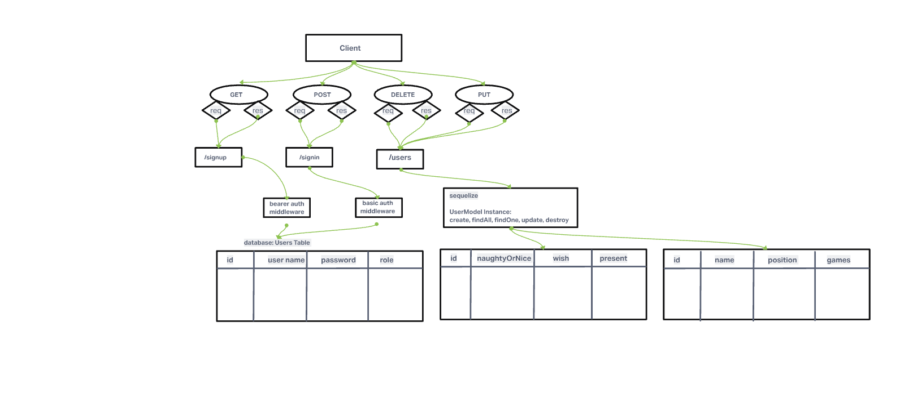

# LAB - Class 8

## Project: Auth API

### Author: Yen Xiong Yuan

### Problem Domain

#### Your server should respond to the following routes:

* POST /signup to create a user.
* POST /signin to login a user and receive a token.
* GET /secret should require a valid bearer token.  
* GET /users should require a valid token and “delete” permissions.  
      

#### Create a new set of routes (V2) within the server

* V2 API Routes (/api/v2/...) must now be protected with the proper permissions based on user capability, using Bearer Authentication and an ACL.   

      - app.get(...) should require authentication only, no specific roles.  
      - app.post(...) should require both a bearer token and the create capability. 
      - app.put(...) should require both a bearer token and the update capability.  
      - app.patch(...) should require both a bearer token and the update capability.
      - app.delete(...) should require both a bearer token and the delete capability.

### Links and Resources

- [GitHub Actions ci/cd](https://github.com/yenxiongyuan/auth-api/actions)

### Setup

#### `.env` requirements (where applicable)

for now I have none and do not require one

#### How to initialize/run your application (where applicable)

- e.g. `npm start`

#### How to use your library (where applicable)

#### Features / Routes

- Feature One: Details of feature
- GET : `/hello` - specific route to hit

#### Tests

- How do you run tests?
- Any tests of note?
- Describe any tests that you did not complete, skipped, etc

#### UML

